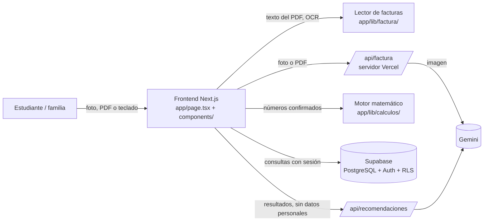

# Arquitectura de ElectriCOs

> Guía, módulo 3: «¿Dónde se genera el dato? ¿Dónde se transforma? ¿Dónde se almacena? ¿Quién puede consultarlo? ¿Qué ocurre si un componente falla?»

## Vista general

| Pieza | Dónde está | Qué hace |
|---|---|---|
| Interfaz | `app/page.tsx`, `app/components/` | Pantallas, formularios, validaciones, navegación |
| Lector de facturas | `app/lib/factura/` | Extrae y valida datos de PDF y fotos |
| Motor matemático | `app/lib/calculos/` | Huella, línea base, meta, avance. Funciones puras |
| Datos | `app/lib/supabase/datos.ts` | Única puerta a la base de datos |
| Servidor | `app/api/*/route.ts` | Llama a la IA con claves secretas que nunca llegan al navegador |
| Base de datos | `supabase/migrations/` | Tablas, reglas de seguridad (RLS) y parámetros oficiales |

## Recorrido de un dato: el consumo de un mes

1. **Se genera** en el medidor de la casa. La empresa lo imprime en la factura: lectura anterior 19 487, lectura actual 19 840.
2. **Entra** a ElectriCOs como PDF, como foto o escrito a mano (`InvoiceScanner`, `ConsumoForm`).
3. **Se transforma**: el lector busca los números (`extraer-texto.ts`, `estructura.ts`, IA) y los valida (`validar.ts`): 19 840 − 19 487 = 353 y 173 + 180 = 353.
4. **La persona lo confirma** o lo corrige en el formulario. Nada se guarda sin su confirmación.
5. **Se almacena** en `consumption_records`. En `invoices` queda la evidencia: lo que leyó la app y lo que se confirmó.
6. **Se calcula** en el navegador con el motor: 353 kWh × 0,220 = 77,7 kg CO₂e.
7. **Se consulta**: solo el dueño del hogar y la docente, por las políticas RLS.

## ¿Qué pasa si algo falla?

| Falla | Qué hace ElectriCOs |
|---|---|
| La IA no responde o no hay clave | Usa el texto del PDF o el OCR del navegador, y ofrece la lectura guiada |
| El OCR no encuentra el consumo | Lectura guiada (encerrar la fila del medidor) o ingreso manual |
| Los números no cuadran (lecturas ≠ consumo) | Aviso "revisar" y confianza baja; la persona decide |
| Supabase no responde | Mensaje claro ("revisa tu conexión"); los parámetros oficiales tienen copia en el código |
| Alguien intenta ver datos de otro hogar | RLS devuelve cero filas: la base de datos no se lo entrega |

## Decisiones de diseño (y por qué)

- **La IA no calcula.** El motor matemático es determinista y tiene pruebas. La IA solo lee facturas y explica resultados.
- **Normalizar a 30 días.** Una factura de 33 días y otra de 28 no se comparan directamente: 415 kWh en 33 días equivalen a 377 kWh en 30.
- **El periodo se nombra por el mes en que termina** (14 ago – 10 sep → septiembre). Así lo hace la factura de Energía de Pereira en su histórico. Si el equipo decide otra convención, se cambia en `periodoDesdeRango` (`app/lib/factura/texto.ts`) y en la prueba correspondiente.
- **No se guardan fotos ni datos personales** de las facturas: los estudiantes son menores de edad y no se necesitan.
