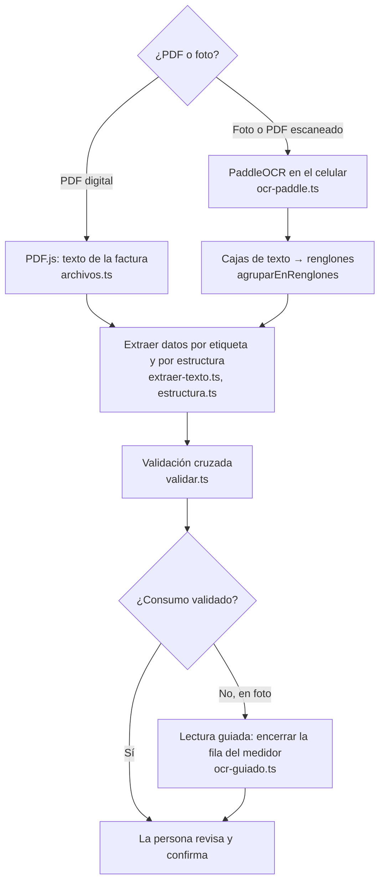

# Lector de facturas

> Código: `app/lib/factura/` · Pruebas: `tests/factura.test.ts` · Guía, módulo 12 (IA y sus limitaciones)
>
> **Todo ocurre dentro del celular.** Ninguna foto ni PDF se envía a un servidor: no hay claves, cuentas ni costos.

## Cadena de lectura



## PaddleOCR: inteligencia artificial en el dispositivo

[PaddleOCR](https://github.com/PaddlePaddle/PaddleOCR) es un lector de texto de código abierto (licencia Apache-2.0) de PaddlePaddle. Usamos su SDK oficial para navegador con los modelos **PP-OCRv6 tiny**:

| Red neuronal | Qué hace | Tamaño |
|---|---|---|
| Detección (`PP-OCRv6_tiny_det`) | Encuentra las cajas donde hay texto | 1,8 MB |
| Reconocimiento (`PP-OCRv6_tiny_rec`) | Lee el texto de cada caja | 4,5 MB |

- Corren con **ONNX Runtime Web**: WebGPU si el celular lo tiene, WebAssembly si no.
- Trabajan en un **Web Worker**, así la pantalla no se congela mientras leen.
- Los modelos se descargan al compilar (`scripts/preparar-ocr.mjs`) y se sirven desde nuestro dominio; el celular los guarda y solo los descarga la primera vez.

### ¿Por qué PaddleOCR y no Tesseract o una IA en la nube?

Prueba del 28/09/2026 en Chromium con la factura de referencia (imágenes anonimizadas):

| Imagen | Tesseract.js | PaddleOCR tiny (app real) |
|---|---|---|
| Captura de pantalla de 616 × 500 | No leyó la fila del medidor | **353 kWh**, lecturas 19 487 → 19 840, en 8 s |
| Foto completa, torcida 1,5° y borrosa | Leyó la fila | **353 kWh**, Cartago, estrato 4, en 10 s |
| Región de la factura | Leyó la fila | **353 kWh**, en 4 s |

- El modelo "small" leyó igual que el "tiny", pero fue 4 veces más lento: por eso usamos "tiny".
- La IA en la nube (Gemini) se descartó: la versión gratuita permite que Google use las imágenes, exige ser mayor de edad y las claves fallaron (ver [bitácora](bitacora.md), E03 y E08).

## Por qué reconocer "por estructura"

En el PDF de Energía de Pereira, las etiquetas ("Lectura anterior", "Consumo"…) son parte del diseño de fondo y **no están en el texto**. Por eso `estructura.ts` reconoce las filas por su forma:

```
1408001303 GNS 19840 19487 353 1 353 267
medidor    marca lectura lectura dif factor consumo promedio
```

Se acepta solo si |19 840 − 19 487| = 353 y 353 × 1 = 353. Si las cuentas no cuadran, no se usa.

En las fotos, PaddleOCR entrega cajas sueltas. `agruparEnRenglones` las encadena de izquierda a derecha: cada caja se une al renglón cuyo último elemento está a su misma altura. Así, aunque la foto esté un poco torcida, la fila del medidor no se parte.

## Validación cruzada (`validar.ts`)

1. ¿Lectura actual − anterior = consumo? → confianza 95 %.
2. ¿El consumo se parece al promedio de la misma factura? (entre 0,4 y 2,5 veces)
3. ¿Está en un rango razonable para un hogar (5–3000 kWh)?
4. ¿El medidor dio la vuelta (99 950 → 120)? Solo si la anterior estaba cerca del máximo y la actual cerca de cero.

Números que **no** deben confundirse con el consumo (prueba "trampas" en `tests/factura.test.ts`): 905,0529 (pesos por kWh), 156 574 y 162 910 (dinero), 349 864 (total), 173 y 180 (franjas), 267 (promedio).

## Experimento sugerido (módulo 12)

Con 10 facturas distintas (PDF y fotos en distintas condiciones), llenen esta tabla:

| Factura | Tipo (PDF / foto) | Condición (luz, ángulo, distancia) | Consumo real | Consumo leído | ¿Correcto? | Confianza | ¿Hizo falta la lectura guiada? |
|---|---|---|---|---|---|---|---|

Preguntas: ¿en qué condiciones falla más? ¿La confianza alta coincide con los aciertos? ¿Hubo algún caso de confianza alta con lectura equivocada (falso positivo)? ¿Qué mejoraría el resultado: más luz, más cerca, más derecho?

La tabla `invoices` guarda lo extraído y lo confirmado para calcular esto con datos reales ([modelo-datos.md](modelo-datos.md)).
