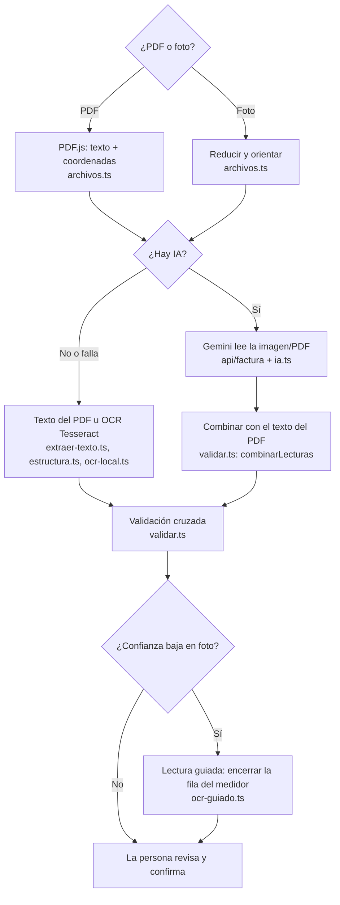

# Lector de facturas

> Código: `app/lib/factura/` · Pruebas: `tests/factura.test.ts` · Guía, módulo 12 (IA y sus limitaciones)

## Cadena de lectura



## Tres formas de leer, con sus límites

| Método | Cómo funciona | Fortalezas | Límites |
|---|---|---|---|
| Texto del PDF | Lee el texto digital del PDF y reconoce filas por su forma | Exacto, rápido, sin internet | Solo PDF digitales (no escaneados) |
| IA (Gemini) | Un modelo de visión "mira" la factura y devuelve JSON | Entiende cualquier formato y fotos difíciles | Necesita internet y clave; puede equivocarse; en la versión gratuita Google puede usar los datos |
| OCR + lectura guiada | Tesseract en el navegador; la persona encierra la fila del medidor | Gratis, privado, sin internet | Requiere foto nítida y un paso más de la persona |

## Por qué reconocer "por estructura"

En el PDF de Energía de Pereira, las etiquetas ("Lectura anterior", "Consumo"…) son parte del diseño de fondo y **no están en el texto**. Por eso `estructura.ts` reconoce las filas por su forma:

```
1408001303 GNS 19840 19487 353 1 353 267
medidor    marca lectura lectura dif factor consumo promedio
```

Se acepta solo si |19 840 − 19 487| = 353 y 353 × 1 = 353. Si las cuentas no cuadran, no se usa.

## Validación cruzada (`validar.ts`)

1. ¿Lectura actual − anterior = consumo? → confianza 95 %.
2. ¿El consumo se parece al promedio de la misma factura? (entre 0,4 y 2,5 veces)
3. ¿Está en un rango razonable para un hogar (5–3000 kWh)?
4. ¿El medidor dio la vuelta (99 950 → 120)? Solo si la anterior estaba cerca del máximo y la actual cerca de cero.

Números que **no** deben confundirse con el consumo (prueba "trampas" en `tests/factura.test.ts`): 905,0529 (pesos por kWh), 156 574 y 162 910 (dinero), 349 864 (total), 173 y 180 (franjas), 267 (promedio).

## Experimento sugerido (módulo 12)

Con 10 facturas distintas (PDF y foto), llenen esta tabla para cada método:

| Factura | Método | Consumo real | Consumo leído | ¿Correcto? | Confianza | Observación (luz, ángulo, empresa…) |
|---|---|---|---|---|---|---|

Preguntas: ¿qué método falla más con fotos oscuras? ¿La confianza alta coincide con aciertos? ¿Hubo algún caso de confianza alta y lectura equivocada (falso positivo)?

La tabla `invoices` guarda lo extraído y lo confirmado para calcular esto con datos reales ([modelo-datos.md](modelo-datos.md)).
