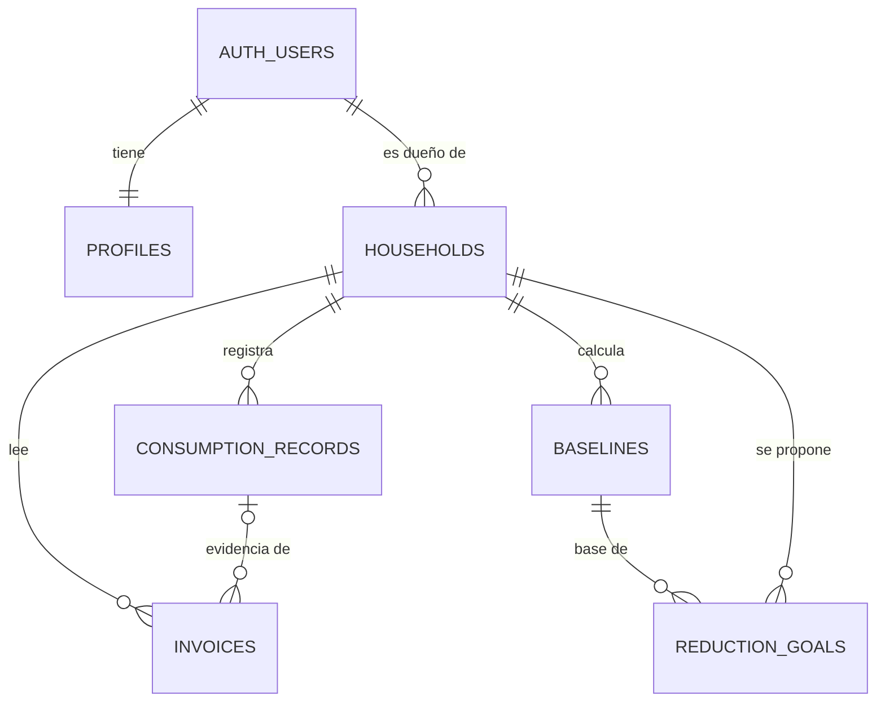

# Modelo de datos

> Guía, módulo 6: la base de datos se deriva de las necesidades de ElectriCOs, no de una lista arbitraria de tablas.
> SQL completo: `supabase/migrations/`.



| Tabla | Pregunta que responde | Campos clave |
|---|---|---|
| `profiles` | ¿Quién usa ElectriCOs y con qué rol? | `rol` (estudiante / docente), `nombre_visible` |
| `households` | ¿De qué hogar hablamos? | `municipio`, `estrato`, `personas`, `sobre_1000_msnm` |
| `consumption_records` | ¿Cuánto consumió el hogar cada mes? | `periodo` (1.er día del mes), `consumo_kwh`, `dias`, lecturas, `fuente` |
| `invoices` | ¿De dónde salió cada dato? | `metodo`, `confianza`, `datos_extraidos`, `datos_confirmados` |
| `energy_parameters` | ¿Con qué factores oficiales calculamos? | `clave`, `valor`, `unidad`, `vigencia`, `fuente`, `url` |
| `baselines` | ¿Contra qué promedio se definió una meta? | `promedio_kwh`, `desde`, `hasta`, `meses` |
| `reduction_goals` | ¿Qué meta se propuso el hogar? | `porcentaje`, `meta_kwh`, `inicio`, `acciones`, `acciones_hechas`, `estado` |

## Reglas que cuida la base de datos (no solo la app)

- Un solo consumo por hogar y mes: `unique (household_id, periodo)`.
- Rangos válidos: estrato 1–6, personas 1–20, consumo entre 0 y 5000 kWh, días 1–120 (`check`).
- Una sola meta activa por hogar (índice único parcial).
- Una línea base no se puede borrar si una meta depende de ella (`on delete restrict`).
- Si se borra un hogar, se borran sus consumos, facturas, líneas base y metas (`on delete cascade`).

## ¿Por qué guardar la línea base en una tabla, si se puede calcular?

Porque la meta se definió contra **esa** línea base. Si después se agregan o borran meses, el promedio cambia, y la meta perdería su referencia. Guardarla es trazabilidad: "el 28 de septiembre propusimos bajar 10 % sobre un promedio de 323,7 kWh".

## ¿Por qué `invoices` guarda lo extraído y lo confirmado?

Para evaluar el lector (guía, módulo 12): comparando ambos se sabe cuántas veces la IA o el OCR acertaron, y en qué campos se equivocan.

```sql
-- ¿Cuántas lecturas corrigieron las personas, por método?
select metodo,
       count(*) as lecturas,
       count(*) filter (where (datos_extraidos->>'consumoKwh')::numeric
                              is distinct from (datos_confirmados->>'consumo_kwh')::numeric) as corregidas
from invoices group by metodo;
```
